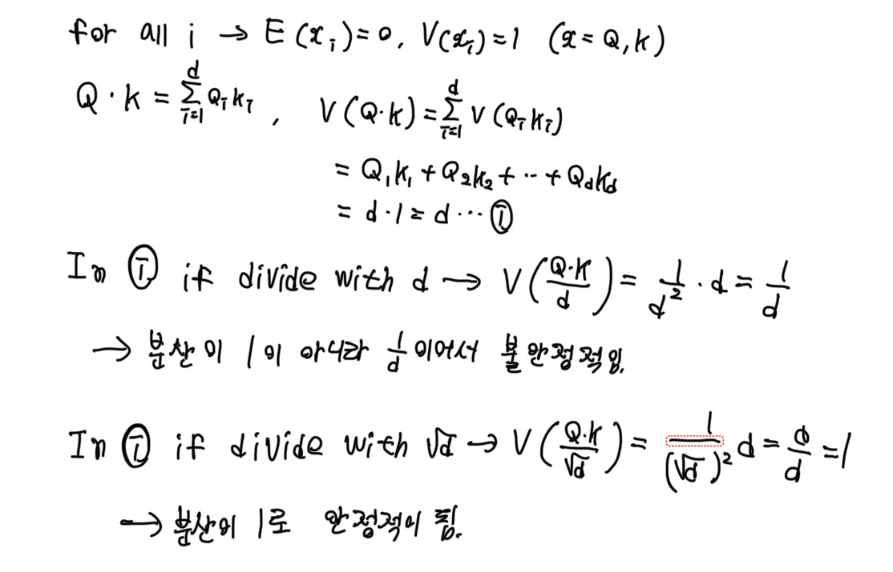

# Transformer and PEFT

Pytorch로 Transformer를 코드 레벨에서 구현하고,   
대표적인 PEFT인 Adapter, LoRA, P-tuning, Prompt tuning, Prefix tuning 또한 코드레벨에서 구현해서 성능을 몸소 실험하는 레포지토리입니다.

---

## 실험 환경

- GPU : NVIDIA RTX3060
- Language : Python 3.10.12
- Framework : Pytorch
- Model : vanila transformer
- Experiment task : SST-2, MNLI, QNLI
- Model matrix: Accuracy, F1, GLUE avg

---

## 구현 Task

- Transformer : 2024-08-09 ~ 2024-08-16 구현 완료
- Adapter
- LoRA
- P-tuning
- Prompt tuning
- Prefix tuning

---

## 이론 정리

논문에 생략된 수학적인 내용도 정확하게 짚고 싶어서 선형대수학 및 확률론의 내용을 세부 설명없이 사용했습니다.

[Transformer](###Transformer)

### Transformer

#### 주요 개념

- Self-Attention
- Multi-Head Attention
- Positional Encoding
- Masking
- Encoder-Decoder Architecture

-----

#### 정리

##### self-Attention

###### Why use?

트랜스포머 논문 제목이 "Attention is all yod need."라는 다소 폭력적인 제목인만큼 트랜스포머에서는 Attention 기법을 매우 강조합니다.  
그 이유는 이전까지 해결되지 않았던 RNN의 long-term dependency problem을 해결했기 때문입니다.  
 
이 문제는 RNN의 계산 구조에서 비롯됩니다. 아래와 같은 recurrence relation을 보면,   
$h_t$ = f( $W_h$ $h_{t-1}$ + $W_x$ $x_t$ + b )
 

여기서 현재 hidden state $h_t$는 오직 직전 hidden state $h_{t-1}$에만 의존합니다.  
이러한 재귀적 구조는 시간이 지남에 따라 과거 정보가 희석되고, 긴 시퀀스에서는 정보가 소실되는 현상으로 이어집니다.  
 
Self-attention은 이와 달리, 코사인 유사도를 기반으로 한 내적 계산으로 모든 토큰 쌍 간의 유사도를 직접 계산하고, 각 토큰이 전체 시퀀스를 동시에 바라볼 수 있도록 설계되어 있습니다.  
이 구조 덕분에 long-term dependency 문제 없이, 문맥 전체를 한 번에 고려하는 계산이 가능해졌습니다.
 

###### How to operate?

self attention은 한 시퀀스 내의 토큰끼리의 의미적 관계와 중요성을 계산하기 위한 알고리즘입니다.  
과정은 5단계로 이루어집니다. 순서대로 정리해보겠습니다.

- Q, K, V 행렬을 구함.  
  입력 시퀀스로부터 워드 임베딩을 통해서 행렬 X를 만들고, 가중치 행렬 $W_Q$, $W_K$, $W_V$와 곱해서 Q, K, V 행렬을 각각 구합니다.
  미니 배치마다 $W_Q$, $W_K$, $W_V$가 갱신되서 더 적합한 Q, K, V 행렬을 구하기 위해 학습합니다.  
- 유사도 측정 : Q와 K의 내적.  
  RNN과 달리 순서대로 하지 않고 전체적으로 보기 위해 벡터 내적으로 코사인 유사도를 기반으로 토큰마다 유사도를 측정합니다.  
- 값의 축소 : $d^{1/2}$로 나눔.  
  내적의 특성상 차원이 커질수록 더해지는 값이 많아지므로 수가 커지게 됩니다.  
  이런 상황에서 수가 차원에 비례해서 커지는 것을 막기위해서 차원의 제곱근으로 나눕니다.  
  개인적으로는 왜 d로 안나누고 $d^{1/2}$으로 나누는지 의문이어서 확률론 관점에서 증명을 해봤습니다. 
  증명은 아래 그림으로 정리하겠습니다.
  
   
- 정규화 : softmax() 함수에 대입  
  중요도를 나타내는 벡터의 수들을 확률로 표현하기 위해서 softmax() 함수에 넣어서 정규화해줍니다.    
- 중요도 결과 계산 : V 행렬과 곱
  softmax를 취해서 중요도를 나타내는 행렬과 입력 시퀀스의 정보를 나타내는 V 행렬의 곱을 통해서 토큰의 중요도를 계산해줍니다.

-----

##### Multi-Head Attention

###### Why use?

1번의 어텐션 행렬 계산으로 올바른 예측 값을 계산할 수 있으면 이상적이지만, 실제로는 그러기 어렵습니다.  
왜냐면, Q,K,V 행렬이 가중치 행렬을 통해서 도출되기 때문에 학습이 필요해서 1번의 계산으로는 부족하기 때문입니다.  
그래서, 하나의 토큰에 대해 head의 수만큼의 어텐션 행렬을 구하고 이 행렬들을 모두 고려해서 올바른 예측 값에 근사한 어텐션 행렬을 만드는 방법으로
정확도를 높이고자 Multi-Head Attention이 도입됐습니다.
 

###### How to operate?

Multi-Head Attention은 다양한 시각에서 토큰 간 관계를 계산하기 위해, 각 헤드에서 독립적으로 attention을 수행한 후 그 결과들을 concatenate합니다.  
예를 들어서 만약 a * b 크기의 어텐션 행렬에 헤드가 h개 있으면 a x (b * h)의 행렬이 됩니다.  
 
이제 이 행렬의 요소들을 모두 고려하면서 크기를 다시 원래대로 되돌리기 위해 (b * h) x b 크기의 가중치 행렬을 곱해서 선형변환을 시켜줍니다.  
최종적으로 나온 어텐션 행렬은 Self-Attention과는 달리, 여러 개의 어텐션 결과를 종합적으로 고려하여 각 토큰의 중요도와 문맥 표현을 더욱 풍부하게 구성할 수 있습니다.  

-----

##### Positional Encoding

###### Why use?

RNN은 토큰이 순서대로 입력되고, 현재 hidden state가 이전 hidden state의 영향을 받기 때문에 문장의 순서를 자연스럽게 학습할 수 있습니다.  
하지만, transformer는 병렬 처리를 위한 행렬 계산 때문에 워드 임베딩만으로는 문장의 순서를 구분할 수 없는 문제가 발생합니다.  
예를 들어, I am Hwang과 Am i hwang처럼 주어와 동사의 위치가 다르면 뜻이 달라지지만, 위치적인 요소를 고려해주지 않으면 두 문장은 같은 문장으로 인식됩니다.  
이런 문제를 해결하기 위해 Transformer에서는 positional encoding을 도입하여 각 단어에 위치 정보를 추가합니다.  
입력 임베딩 + positional encoding을 더해주면 모델이 단어의 의미뿐 아니라 문장 내 위치 정보도 함께 학습할 수 있습니다.  

###### How to operate?

위치 인코딩 행렬은 입력 임베딩 행렬과의 덧셈을 위해 똑같은 크기인 (토큰 수) x (임베딩 차원)입니다.  
행렬의 원소 계산 방법은 아래 수식과 같이 벡터의 홀수번째는 sin으로 계산하고, 짝수번째는 cos으로 계산합니다.  
 
$P(pos, 2i)=sin(pos/10000^{2i/d_model})$  
$P(pos, 2i+1)=cos(pos/10000^{2i/d_model})$  
 
sin과 cos이 번갈아 사용된 이유는 벡터의 원소끼리 다른 패턴을 가지게 해서 학습에 더 용이하게 한 것으로 예상됩니다.  
sin이나 cos 하나만 사용될 경우에는 i가 커질수록 원소가 증가하거나 감소하게 되는데 -1~1 사이에만 존재하는 삼각함수의 특성상 값의 패턴이 비슷하게 
되서 위치 인코딩에 큰 영향을 줄 수 없게 되서 sin과 cos을 번갈아 쓰는 방법으로 패턴을 일관적이지 않게 해서 학습에 더 좋은 성능을 준 것으로 예상됩니다.